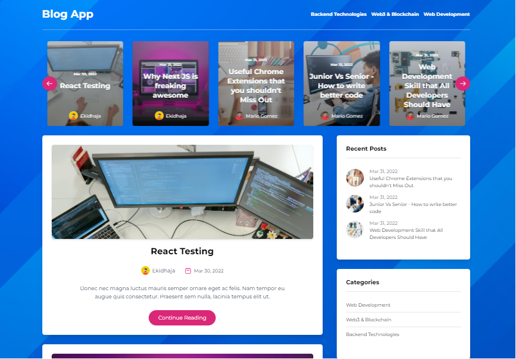

## Overview

[View Live site](https://blog-app-wine.vercel.app/)

## Description

This is a fully responsive CMS Blog app with modern features like recent posts, featured posts, author infomation, comments, comments moderation, etc. It is fully managed from dedicated CMS (GraphCMS)

## Tech Stack

- [React JS](https://reactjs.org/) - For frontend.
- [Next JS](https://nextjs.org/) - For frontend, routing, API endpoints.
- [Tailwind CSS](https://tailwindcss.com/) - For styling.
- [GraphQL](https://graphql.org/) - For quering.
- [GraphCMS](https://graphcms.com/) - For Schemas and content managament.
